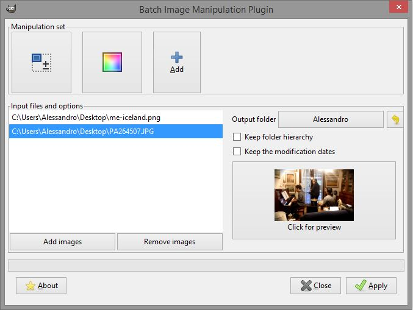

# Easy multiple image processing with GIMP

If you work with GIMP and need to process many images, take a look at BIMP - **B**atch **I**mage **M**anipulation **P**lugin for GIMP.

It's a plugin, that allows you to select many images and apply one or many tranformations to all lf them. 

Go to [BIMP page](https://alessandrofrancesconi.it/projects/bimp/) and download the plugin for your OS. Install a plugin on GIMP. After that, you'll find "Batch Image Manipulation..." inside the "File" menu. 

Load your images, select transformation(s) and output directory and press "Apply". BIMP will process all the selected images.
