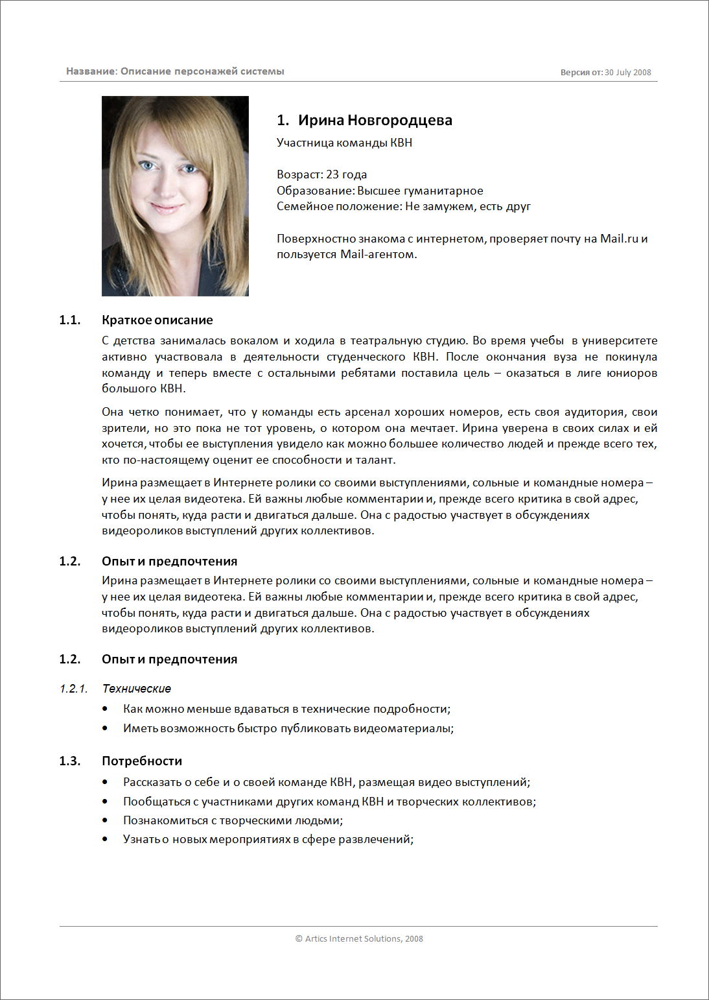

# Персонажи

## Определение и основная идея 

**Персонажи** это:

- модели пользователей
- составные **архетипы**, создаваемые на основе поведенческих данных, собранных в ходе этнографических интервью со многими реальными пользователями
- описание группы пользователей с их ожиданиями, переживаниями, опытом, потребностями, воплощенное в одном фиктивном профиле
- серия документов, которые дают представление о ключевых типах пользователей системы.

Персонажи создаются на основе исследований.
Целевая аудитория продукта анализируется и группируется в 3–4 основных персонажа. Каждый персонаж характеризуется контекстом и целями ее использования системы, ожиданиями от нее, а также общим описанием.
Персонажи – не настоящие люди, но они создаются на основе мотивации и поведения реальных людей, которых мы наблюдали, и выступают в роли представителей реальных людей в процессе проектирования.

Основой для персонажей являются поведенческие шаблоны, которые мы наблюдаем на стадии исследований и формализуем на стадии моделирования.

> Логика может подсказывать вам, что для создания продукта, который призван удовлетворить самую широкую аудиторию пользователей, нужно сделать его функциональность как можно более широкой, чтобы приспособить его к нуждам большинства людей. Однако эта логика порочна. Лучший способ успешно удовлетворить потребности широкой аудитории – проектировать для конкретных типов людей с конкретными потребностями.
Беспорядочно наращивая функциональность продукта, чтобы охватить как можно более широкую аудиторию, вы увеличиваете когнитивную нагрузку на всех пользователей и осложняете им ориентирование в пределах продукта. Возможности, которые понравятся одним пользователям, вероятно, войдут в противоречие с потребностями других.

> Алан Купер "Об интерфейсе. Основы проектирования взаимодействия"

Представление аудитории продукта в виде персонажей является уместным и действенным благодаря уникальным особенностям персонажейй: они вызывают [эмпатию - @todo: добавить добавить страницу]() (сопереживание) проектировщиков и разработчиков по отношению к людям, ради которых выполняется проектирование. Чувство эмпатии абсолютно необходимо проектировщикам, которым предстоит при проектировании принимать концептуальные и детальные решения, исходя как из когнитивных, так и из **эмоциональных свойств** персонажей, представленных целями этих персонажей.

## Чем полезны персонажи

Персонажи помогают проектировщикам:

- Определять, что должен делать продукт и каким должно быть его поведение.  
  Цели и задачи персонажей образуют фундамент для проектирования.

- Общаться с заинтересованными лицами, разработчиками и другими проектировщиками.  
  Персонажи задают общий язык для обсуждения проектных решений, а также помогают удерживать фокус на пользователях на каждом шаге процесса.

- Достигать взаимопонимания и согласия в вопросах проектирования.  
  Персонажи сокращают потребность в подробных моделях и диаграммах: многочисленные нюансы поведения пользователей проще понять благодаря повествовательным средствам, на которых основана работа с персонажами. Проще говоря, поскольку персонажи напоминают живых людей, они воспринимаются легче, чем диаграммы и списки функций.

- Оценивать эффективность решений.  
  На персонажах можно испытывать проектные решения в процессе их формирования так, словно вы показываете их реальным пользователям. Это не отменяет необходимость тестирования на реальных пользователях.
  
- Вносить вклад в работу других подразделений, связанных с продуктом, например в планы по маркетингу и продажам.

Персонажи помогают при проектировании избежать проблем:

- [Проблема "пластилинового" пользователя](../ux-design/problem-flexible-user.md)
- [Проектирование под себя](../ux-design/problem-design-for-self.md)
- [Проектирование в расчете на исключительные ситуации](../ux-design/problem-exception-driven-design.md)

Персонажи, как модели, должны быть основаны на данных (наблюдениях за реальностью).

> Не путайте архетипы, которыми, по сути, являются персонажи, со стереотипами. Стереотипы во многих отношениях являются противоположностью хорошо проработанных персонажей, так как представляют предубеждения и предположения проектировщиков и исследователей, а не фактические данные.

> Алан Купер "Об интерфейсе. Основы проектирования взаимодействия"

## Краткая характеристика персонажей

Персонажи:

- основаны на исследованиях
- представляются как отдельные личности
- являются представителями групп пользователей
- описывают варианты поведения
- должны обладать мотивацией
- могут представлять не только пользователей, но и покупателей (в случае, когда пользователь и покупатель - разные люди)

## Синтез персонажей

Основные данные, на которые можно опираться при синтезе персонажей:

- интервью, основанные на этнографических методах
- контекстное исследование либо другие формы обсуждений с действительными и потенциальными пользователями и наблюдения за ними
- прочие [пользовательские исследования]()

Вспомогательные данные, которые могут помочь сделать персонажей более точными:

- данные интервью с пользователями вне контекста использования
- информация о пользователях, предоставленная заинтересованными лицами и экспертами в предметной области
- данные исследований рынка, таких как фокус-группы и опросы
- модели сегментации рынка
- результаты обзора литературы и более ранних исследований.

Вспомогательные данные не могут заменить прямое взаимодействие и наблюдение за пользователями в привычной для них среде.

Повторное использование персонажей в разных продуктах - **плохая практика**. Ошибкой будет считать, что два пользователя, проявляющих сходное поведение в отношении одного продукта, будут сходно вести себя и в отношении другого. Поэтому под каждый продукт желательно разрабатывать самостоятельных персонажей.

## Примеры документов

## Типы персонажей

Персонажи подразделяются на ннсколько типов:

- ключевой
- второстепенный
- дополнительный
- покупатель
- обслуживаемый
- отрицательный

### Ключевые персонажи

Задают основную цель при проектировании интерфейса. На один интерфейс в продукте может приходиться **только один** ключевой персонаж.

При этом, для некоторых (например, копроративных) продуктов возможно наличие нескольких интерфейсов, каждый из которых ориентирован на отдельного ключевого персонажа.

когда  целью  является  ключевой персонаж,  то,  что  приносит удовлетворение ему, у всех  прочих персонажей  по крайней  мере  не  вызывает  неудовольствия.

Ключевой персонаж  выбирается  методом  исключения: цели  каждого персонажа следует  рассмотреть в сравнении  с  целями  остальных.  Если не  очевидно,  какой из  персонажей  является  ключевым,  это может оз начать одно из  двух:  или  продукту требуется несколько интерфейсов, каждый  из которых  предназначен для  своего  ключевого  персонажа (так  часто  бывает  в корпоративных  и технических продуктах), или  же продукт «берет на  себя» слишком  многое. Если у  потребительского продукта  несколько  ключевых персонажей,  то,  возможно,  объем  его функциональности слишком широк.

### Второстепенные персонажи

В основном, довольны интерфейсом ключевого персонажа, но имеют дополительные потребности, которые можно включить в продукт, не нарушая его целостности и способности служить ключевому персонажу.

Если второстепенных персонажей получается более четырех, это может значить, что продукт расчитан на слишком размытую целевую аудиторию.

Помимо основных и второстепенных, существуют дополнительные персонажи. Их нужды полностью представлены сочетанием нужд ключевого и второстепенного персонажей.

На каждый интерфейс может приходиться любое количество дополнительных персонажей.

Часто доп. персонажи - политическая необходимость. Это персонажи, которых приходится включать, чтобы учесть предположения заинтересованных лиц.

### Персонажи покупателей

Отражают потребности покупателей, но не конечных пользователей интерфейса.
Иногда, в корпоративных средах, кто-то из таких персонажей можеттоказаться ключевым, если ему нужен собственный административный интерфейс.

### Обслуживаемые персонажи

Не являются пользователями продукта, но их непосредственно затрагивает применение этого продукта.

Пример: пациент, которого лечат прибором для радиотерапии, не является пользователем прибора, но хороший интерфейс этого продукта **обслуживает** его.

Эти персонажи - способ отследить социальные и физические воздействия второго порядка, оказываемые продуктом.

### Отвергаемые персонажи

Те, для кого продукт **не предназначен**. Не являются пользователями продукта, не являются целью проектирования продукта.

---
Источники:

- Книга "Алан Купер - Об интерфейсе. Основы проектирования взаимодействия"
- [uxexperience.net: Артефакты: персонажи](http://uxexperience.net/useful/artefakty-persona)
- [www.uimodeling.ru](http://www.uimodeling.ru/)

