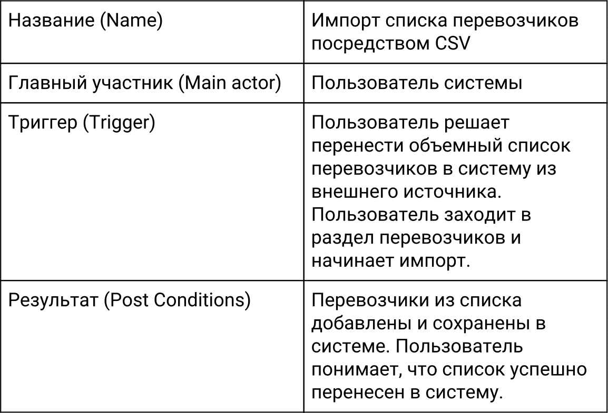
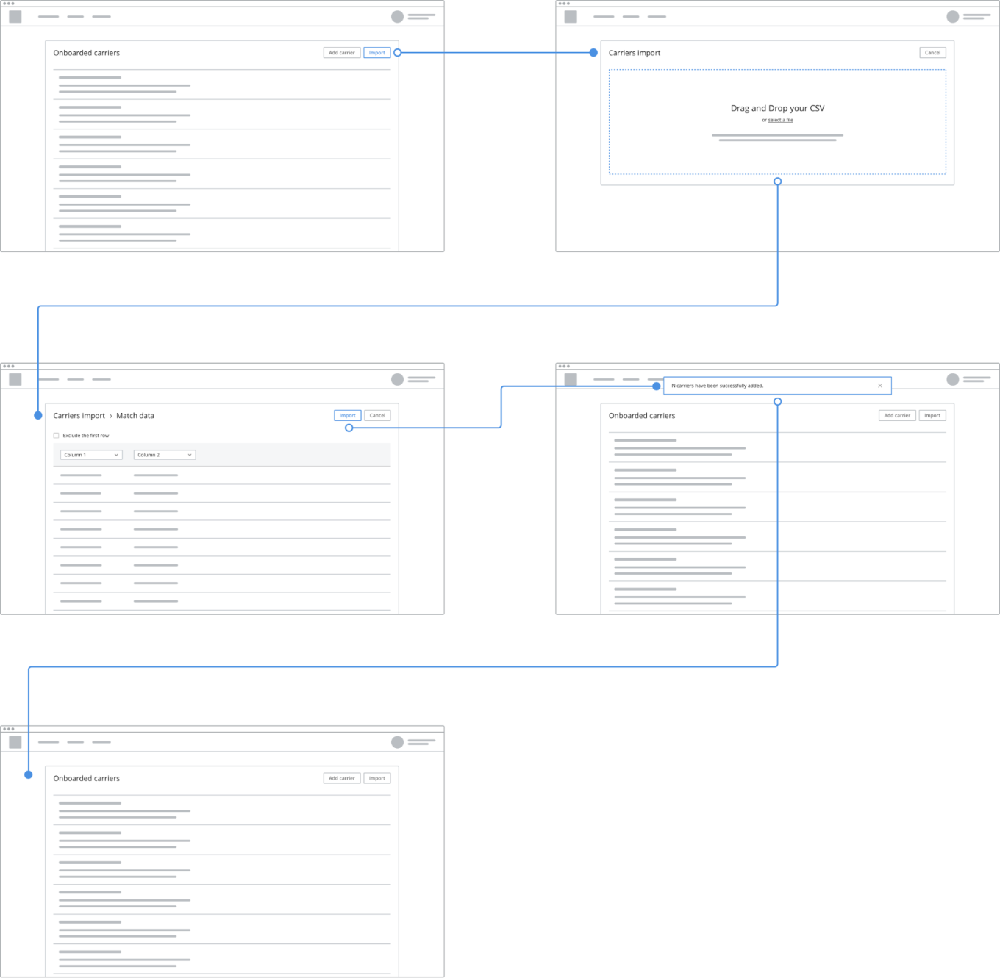
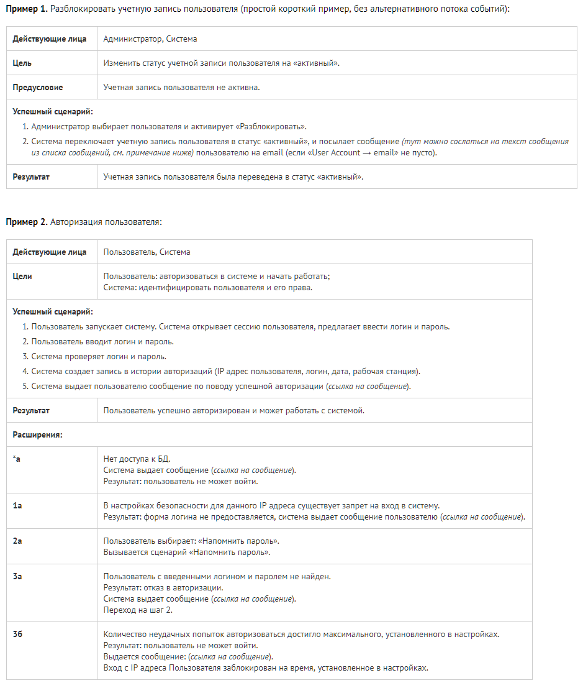

# Use case (сценарий использования)

## Определение

Use case - сценарий использования - письменное описание того, как пользователь может взаимодействовать с системой, чтобы достичь определённой цели.

Use Case - последовательность простых шагов, которые пользователь должен пройти, чтобы достичь цели. 

В большинстве случаев Use Case описывает, что делает система, а не как.

Use case может быть дополнен графикой, например простой workflow-диаграммой. Это делает Use Case более простым для восприятия и получения обратной связи. Но делать это не обязательно.

## Структура Use Case

В зависимости от сложности и детализированности Use Case может содержать следующие элементы:

* Название (Name) — название Use Case: короткое, понятное, отражающее суть.
* Краткое описание (Brief Description) — текст, описывающий данный Use Case.
* Участники (Actors) — список участников взаимодействия. Часто состоит из одного человека.
* Предусловия (Preconditions) — условия, которые должны быть выполнены перед началом реализации данного Use Case.
* Триггер (Trigger) — событие или условие, которое заставляет пользователя приступить к выполнению Use Case.
* Базовый сценарий (Basic Flow) — последовательность действий, которые выполняет участник для успешного достижения цели. Также может называться Normal Flow, Primary Scenario и Happy Path.
* Альтернативные сценарии (Alternative Flows) — описание альтернативных сценариев выполнения Use Case. Важное условие альтернативных сценариев — участник в итоге успешно достигает цели.
* Исключительные сценарии (Exceptional Flows) — все, что может привести участника к невыполнению Use Case.
* Постусловие (Post Conditions) — результат после выполнения Use Case.

## Пример простейшего use case

**Basic Flow (B1)**

0. Пользователь начинает импорт перевозчиков.
0. Пользователь нажимает импорт перевозчиков через CSV-файл.
0. Система дает возможность выбрать файл с компьютера или перетащить его для загрузки.
0. Пользователь использует выбор файла с компьютера.
0. Пользователь выбирает CSV-файл со списком перевозчиков.
0. Система обрабатывает выбранный файл.
0. Система проверяет файл на наличие ошибок.
0. Система не находит ошибок, препятствующих дальнейшей работе.
0. Система выводит предпросмотр данных загруженного файла.
0. Система предлагает сопоставить типы данных.
0. Пользователь сопоставляет типы данных с теми, что есть в системе.
0. Пользователь нажимает импорт.
0. Система импортирует данные.
0. Система проводит все необходимые проверки.
0. Система успешно заканчивает импорт перевозчиков.
0. Система показывает обновленный список перевозчиков.
0. Система информирует пользователя об успешном завершении задачи.
0. Пользователь видит обновленный список перевозчиков.

Use Case можно сопроводить быстро заскетчированными основными экранами — так проще донести до другого человека суть происходящего.

Вроде таких:

## Польза use cases

Чем полезно написание сценариев для продукта:

* Проектирование интерфейса и опыта взаимодействия происходят быстро и просто.
* Интерфейс получается более понятным и логичным, повышая эффективность работы и обучения.
* Быстро выявляются ошибки спроектированного опыта взаимодействия.
* Более значимые элементы интерфейса легче выносить на верхний уровень.
* Появляется понимание того, что может пойти не так в ходе взаимодействия пользователя с продуктом.
* Use Case помогает дизайнеру объяснить другим участникам команды, как должен вести себя продукт.
* Помогает экономить время на изготовление дизайна, убирая ненужные части продукта.

## Дополнительные примеры сценариев

## Общие рекомендации по написанию сценариев

Используйте минимальное количество слов и пунктов, необходимых для однозначного понимания сценария. Если юзкейс получается слишком длинный, возможно, лучше будет разбить его на несколько. С очень длинными сценариями, с большим количеством расширений, работать крайне неудобно.

Если в двух и более сценариях повторяется одинаковый набор шагов, есть смысл вынести эти шаги в отдельный сценарий, и ссылаться на них. Документ будет легче. А если что-то в этих шагах поменяется, то достаточно будет изменить в одном месте.

Список сообщений, которые система выдает пользователю, стандартные тексты электронных писем и т.п. удобно расположить в едином месте в документе, и ссылаться на нужный пункт из разных юзкейсов, т.к. сообщения в сценариях часто дублируются.

---
**Источники**:

- [VC.ru: Use Case в дизайне: пример применения пользовательских сценариев от стартапа Trucker Path](https://vc.ru/18197-trucker-path-design)
- [dou.ua: Как и зачем писать Use Cases](https://dou.ua/lenta/articles/use-cases/)
