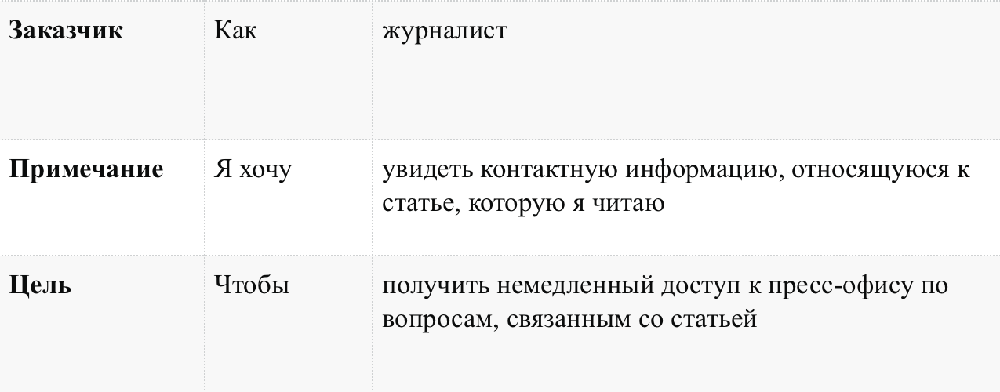

# User stories (пользовательские истории)

## Определение и описание

Пользовательские истории (user story):

- способ описания требований к разрабатываемой системе, сформулированных как одно или более предложений на повседневном или деловом языке пользователя
-  короткая формулировка намерения, описывающая что-то, что система должна делать для пользователя
- в некотором роде, пожелание со стороны пользователя/персонажа к создаваемому продукту

User Story  —  это не требования в обычном понимании.

Каждая пользовательская история ограничена в размере и сложности. Часто история пишется на маленькой бумажной карточке. Это гарантирует, что она не станет слишком большой.

Истории обычно пишутся либо одобряются ролью владельца продукта.

Пользовательские истории — быстрый способ документировать требования клиента, без необходимости разрабатывать обширные формализованные документы и впоследствии тратить ресурсы на их поддержание. Цель пользовательских историй состоит в том, чтобы быть в состоянии оперативно и без накладных затрат реагировать на быстро изменяющиеся требования реального мира.

Преимущества историй:

- Истории короткие. Они представляют маленькие кусочки деловой ценности, которые можно реализовать в период от нескольких дней до нескольких недель.
- Позволяют разработчикам и клиентам обсуждать требования на протяжении всей жизни проекта
- Нуждаются в очень небольшом обслуживании
- Рассматриваются только в момент использования
- Поддерживают близкий контакт с клиентом
- Позволяют разбить проект на небольшие этапы
- Подходят для проектов, где требования изменчивы или плохо поняты.
- Облегчают оценку заданий

Особенности историй:

- Они не являются детальным описанием требований (то-есть того, что система должна бы делать), а представляют собой скорее обсуждаемое представление намерения (нужно сделать что-то вроде этого)
- Они являются короткими и легко читаемыми, понятными разработчикам, стейкхолдерам и пользователям
- Они представляют собой небольшие инкременты ценной функциональности, которая может быть реализована в рамках нескольких дней или недель
- Они относительно легко поддаются эстимированию, таким образом, усилия, необходимые для реализации, могут быть быстро определены
- Они не занимают огромных, громоздких документов, а скорее организованы в списки, которые легче упорядочить и переупорядочить по ходу поступления новой информации
- Они не детализированы в самом начале проекта, а уже более детально разрабатываются «точно в срок», избегая таким образом слишком ранней определенности, задержек в разработке, нагромождения требований и чрезмерно ограниченной формулировки решения
- Они требуют минимум или вовсе не требуют сопровождения и могут быть безопасно отменены после имплементации

## Структура user story

Текст истории должен объяснять роль/действия пользователя в системе, его потребность и профит, который пользователь получит после того как история случится.

Типовая история записывается в формате:
Как <роль/персона>, я <что-то хочу получить>, <с такой-то целью>.

На примере книжного магазина, можно сочинить такие истории:

* Как потребителю мне удобно искать книги по жанрам, чтобы быстро найти те, которые я люблю читать. 
* Как потребитель я, отбирая книги для покупки, хочу класть сразу каждую в корзину. 
* Как управляющий по выпуску новой продукции я хочу иметь возможность отслеживать покупки наших клиентов, чтобы быть в курсе, какие книги им можно предлагать.

У каждой истории:

* Есть один actor
* Есть одно действие
* Есть одна ценность / value / impact. 

При написании истории ценность допустимо выделять ЗАГЛАВНЫМИ БУКВАМИ. Так как именно ценнность - ответ на вопрос "чтобы что?" - является критическим важной вещью при составлении истории. Если адекватного ответа на "чтобы что?" нет, то вы делаете что-то бесполезное.

Пример истории:

При написании user story с вашей командой разработчиков всегда начинайте с обдумывания и обсуждения целей вашего пользователя:

- почему он хочет использовать эту систему?
- чего он пытается достичь?
- что заставило его искать ваш сервис?
- в каких условиях он использует её: дома/на работе/по телефону/во время ухода за ребенком?
- как часто он пользуется ей?

---

Источники:

- [ru.wikipedia: Пользовательские истории](https://ru.wikipedia.org/wiki/Пользовательские_истории)
- [medium.com: Как писать User Story](https://medium.com/@alexandertvar/как-писать-user-story-2410093b23c2)
- [habrahabr.ru: Работаем с User stories: Руководство Gov.uk](https://habr.com/company/friifond/blog/284032/)