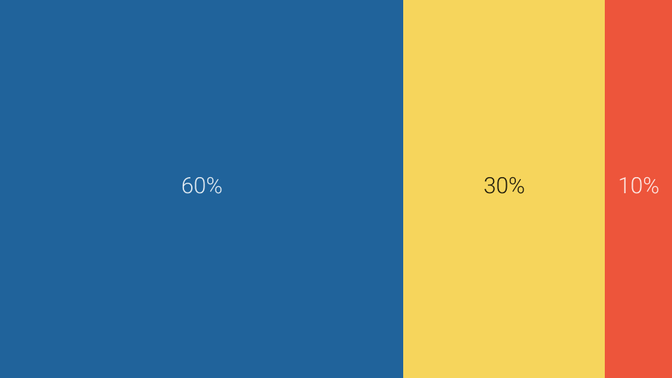
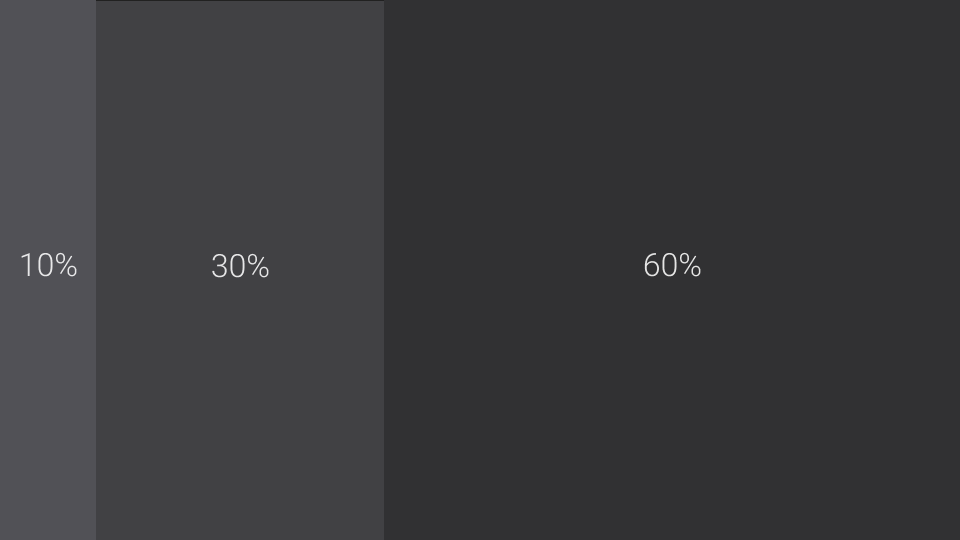

# Правило 60-30-10

Простое правило, которое часто используется при подборе цветов и при проектировании макетов пользовательского интерфейса.

При работе с цветами это правило исторически пришло из области декора интерьеров.

Следование правилу 60-30-10 позволяет создать и поддерживать баланс в интерфейсе.

## Работа с цветами

Согласно этому правилу, 60% пространства оформляется основным цветом, 30% оформляется вторым основным цветом, а 10% - акцентным цветом или цветами.

Например, в рамках основного цвета можно использовать несколько его оттенков (так, чтобы в сумме их использование не превышало 60%).

## Проектирование макета

Это же правило может пригодиться при проектировании трехколоночного макета для приложений вроде мессенджеров, почтовых клиентов, RSS-ридеров и заметочников.

---

Источники:

- [livejournal.com: Сочетания цветов. Правило 60/30/10](https://t-demi.livejournal.com/251315.html)