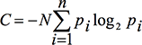
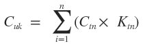

# Количество объектов в UI

По-сути, это - количество классов на которые можно разбить объекты интерфейса.

Область применения этого метода достаточно ограничена. Он подходит, скорее, для небольших приложений, в которых можно относительно легко выделить основные задачи и постоянные последовательности действий.

Метод базируется на методике оценки сложности системы Тима Комбера и Джона Мэлтби, изложенной в работе Comber T., Maltby J.R. Investigating Layout Complexity; in Proc. CADUI, 1996.

Обозначим сложность системы C. В соответствии с теорией информационной энтропии Клода Шеннона, доработанной Джи Бонсипе сложность будет определяться по формуле:

Где:

- N — количество всех объектов
- pi – отношения объектов в i-том классе ко всем объектам (pi =ni/n )
- n – количество классов объектов
- ni – количество объектов i-го класса

Для использования в видео-дисплейных терминалах привяжем сложность к расположению и размерам объектов:
C = CS + CD,
где CS основана на классах-размерах объектов и CD на классах-взаимном расположении.

Сложность отдельного объекта: 
CO = C/N 

Чтобы сделать оценку более привязанной к жизни, можно ввести коэффициенты значимости пользователей и задач.

Пользователи разбиваются на несколько групп в зависимости от их нужд и выполняемых задач, для каждого типа пользователей задается коэффициент значимости.

Он зависит от: 

- количества пользователей данного типа, 
- частоты использования ими продукта, 
- стоимости их времени или маркетинговой значимости данного типа. 

Где:

- Cuk — сложность системы для k-того типа пользователей
- Ctn — сложность n-ной задачи
- Ktn — коэффициент важности n-ной задачи для пользователя

После того, как мы получаем информацию о том, насколько сложно пользоваться интерфейсом каждой группе пользователей, мы можем вычислить итоговую сложность. Для этого нужно суммировать сложности для типов пользователей помноженные на весовые коэффициенты значимости пользователей.

Главное отличие такого подхода от исходной методики — мы опираемся на реальных людей с реальными нуждами. Программа не может быть абстрактно сложной, она может быть сложной для людей, чьи задачи не выполняет или выполняет долго, и перегружая ненужной информацией. По сути, понятие сложности переопределяется в соответствие задачам.

**Источники и дополнительная информация**:

[habrahabr.ru: Как измерить интерфейс. Количественный критерий](https://habrahabr.ru/post/166329/)

