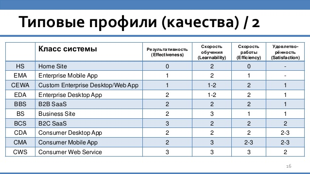

# Типовые профили качества UI

**Результативность (effectiveness)**

Процент успешного завершения сценариев необученным пользователем.

Должен составлять не менее:

- Уровень качества 0: - 
- Уровень качества 1: 66%
- Уровень качества 2: 80%
- Уровень качества 3: 95%

**Скорость обучения (learnability)**

Длительность обучения, необходимая для доведения результативности до 95%

Не должна превышать:

- Уровень качества 0: -
- Уровень качества 1: 240 мин.
- Уровень качества 2: 10 мин.
- Уровень качества 3: 0

**Продуктивность (efficiency) - скорость работы обученного пользователя**

Среднее время выполнения поисковых сценариев в 80% случаев, не должно превышать:

- Уровень качества 0: -
- Уровень качества 1: 3 мин
- Уровень качества 2: 1 мин
- Уровень качества 3: 0.3 мин

## Нормы профилей качества для разных типов систем

