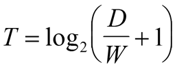
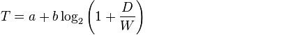

# Закон Фиттса

Закон Фиттса — это общий закон, касающийся сенсорно-моторных процессов, связывающий время движения с точностью движения и с расстоянием перемещения.

Закон Фиттса звучит следующим образом: время достижения цели прямо пропорционально дистанции до цели и обратно пропорционально размеру цели.

То есть, чем дальше объект находится, тем больше времени уйдет у пользователя на перемещение к нему указателя мыши.
На самом деле закон логарифмический:

Где:

- T — время достижения цели
- D — дистанция до цели
- W — размер цели

Это значит что переводя указатель к более удаленному объекту пользователь перемещает указатель мыши значительно быстрее.

А также, чем больше будет размер объекта, тем меньше будет затрачено времени для щелчка на нем!

Существует более сложный вариант математического выражения закона Фиттса:

Где:

- T — среднее время, затрачиваемое на совершение действия
- A — среднее время запуска/остановки движения
- B — величина, зависящая от типичной скорости движения. Эта константа может быть определена экспериментально
- D — дистанция от точки старта до центра цели
- W — ширина цели, измеренная вдоль оси движения

----

Источники:

[ru.wikipedia: Закон Фиттса](https://ru.wikipedia.org/wiki/Закон_Фиттса)
[Lookatme.ru: Свайп против тэпа: Каким будет будущее мобильных интерфейсов](http://www.lookatme.ru/mag/how-to/ask/205331-swipe-or-tap)
